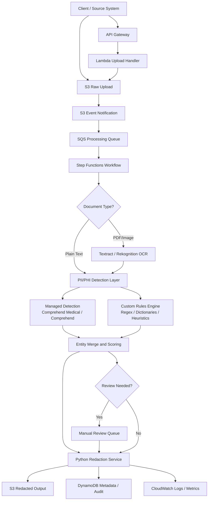
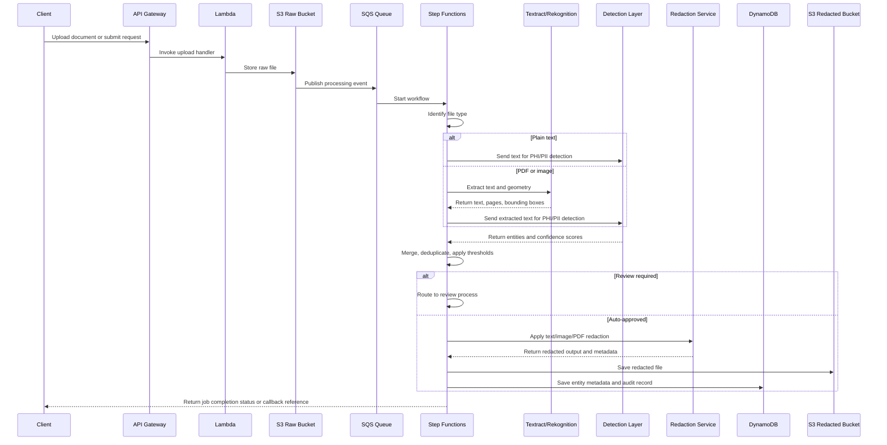

# Medical Records Redaction System

## General Development Requirements

**Project Name:** Medical Records Redaction System
**Target Platform:** AWS
**Backend Preference:** Python
**Processing Model:** Async batch-first system with optional sync API
**Scale:** Moderate scale, approximately **10,000 to 100,000 documents per day**
**Compliance Posture:** HIPAA / PHIPA aligned
**Supported Inputs:** Text and image-based medical records
**Outputs:** Redacted file and structured entity metadata

---

## 1. Purpose

The purpose of this system is to automatically detect and redact Protected Health Information (PHI) and Personally Identifiable Information (PII) from medical records received as text or image-based documents.

The system must support both:

* **Plain text inputs**
* **Scanned or digital documents/images containing text**

The system must produce:

* a **permanently redacted output file**
* a **machine-readable metadata file** describing detected entities, confidence scores, positions, and processing details
* a **traceable audit record** for compliance and operational review

---

## 2. Scope

This system will process medical records containing sensitive information such as:

* patient names
* phone numbers
* addresses
* Social Insurance Numbers (SIN)
* email addresses
* dates of birth
* medical record numbers
* other PHI/PII as defined by policy

The system will be designed primarily for asynchronous document processing, while also exposing an optional synchronous API for smaller requests and low-latency use cases.

---

## 3. Business and Operational Assumptions

The following assumptions apply to this version of the requirements:

* The platform must support **batch-oriented asynchronous processing as the primary mode**
* The system may expose an **optional synchronous API** for small inputs
* Daily throughput is expected to range from **10k to 100k documents**
* The solution must be designed with **HIPAA / PHIPA-aligned security and auditability**
* Every successful job must generate:

  * a redacted output file
  * entity-level metadata
* The backend implementation should use **Python**

---

## 4. High-Level Objectives

The solution must:

1. Receive text and image-based medical records securely
2. Extract text from uploaded content when needed
3. Detect PHI/PII using managed AWS services and custom rules
4. Apply irreversible redaction to text and visual documents
5. Persist redacted output and metadata
6. Support audit, observability, and controlled review workflows
7. Scale reliably under moderate production load

---

## 5. Functional Requirements

## 5.1 Input Ingestion

The system shall accept the following input types:

* Plain text
* PDF documents
* Image files such as JPG, PNG, and TIFF

The system shall support ingestion through:

* API-based upload
* Object storage upload to Amazon S3
* Internal producer systems or partner systems via controlled API integration

The system shall automatically identify document type and route it to the correct processing path.

---

## 5.2 Processing Modes

### 5.2.1 Asynchronous Mode

The primary processing mode shall be asynchronous.

This mode shall:

* accept large files and large volumes
* queue work for processing
* support retries and failure handling
* allow clients to retrieve job status later

### 5.2.2 Synchronous Mode

The system may provide an optional synchronous API for smaller files and short-lived requests.

This mode shall:

* be limited by file size and processing time
* return either immediate results or a fallback job identifier when async routing is required

---

## 5.3 Text Extraction

For files that are not already plain text, the system shall extract text before redaction.

### 5.3.1 OCR Services

The system shall use:

* **Amazon Textract** for OCR on PDFs and scanned documents
* **Amazon Rekognition DetectText** where helpful for text embedded in images

### 5.3.2 Extracted Data

The text extraction layer shall return:

* extracted text content
* word or line positions
* page references
* bounding box geometry when available

This information shall be preserved for redaction mapping and metadata generation.

---

## 5.4 PHI/PII Detection

The system shall detect PHI/PII using a layered approach.

### 5.4.1 Managed Detection

Where applicable, the system shall use:

* **Amazon Comprehend Medical DetectPHI** for English clinical text
* **Amazon Comprehend DetectPiiEntities** for general PII detection where appropriate

### 5.4.2 Custom Detection

The system shall include a custom detection layer implemented in Python using:

* regex-based rules
* dictionary-based rules
* contextual heuristics

This layer shall support detection of items such as:

* SIN
* phone numbers
* addresses
* email addresses
* record identifiers
* localized or customer-specific formats not reliably covered by managed models

### 5.4.3 Detection Consolidation

The system shall merge and deduplicate results from all detection layers.

It shall maintain:

* entity type
* confidence score
* source detector
* text position
* page position and bounding box when available

---

## 5.5 Redaction

### 5.5.1 Text Redaction

For plain text outputs, the system shall replace detected sensitive spans with a configurable token such as:

`[REDACTED]`

The system shall preserve readability and document structure whenever possible.

### 5.5.2 Image and PDF Redaction

For PDFs and images, the system shall apply **permanent visual redaction**, not just overlay masking in a viewer.

The redaction layer shall:

* map detected entities to coordinates
* draw irreversible black boxes or approved masking shapes
* generate a sanitized output file

### 5.5.3 Redaction Integrity

The system shall ensure that redacted data is not recoverable from:

* text layers
* hidden PDF content
* metadata fields that should also be sanitized if required by policy

---

## 5.6 Output Generation

For each processed document, the system shall generate:

1. **Redacted file**
2. **Entity metadata JSON**
3. **Job processing metadata**
4. **Audit trail entry**

The entity metadata shall include, where available:

* entity type
* original text or masked representation according to policy
* confidence score
* start and end offsets
* page number
* bounding box geometry
* detector source
* processing timestamp

Example structure:

```json
{
  "job_id": "job-12345",
  "document_type": "pdf",
  "status": "completed",
  "entities": [
    {
      "type": "NAME",
      "confidence": 0.98,
      "start": 120,
      "end": 128,
      "page": 1,
      "source": "comprehend_medical",
      "bounding_box": {
        "left": 0.13,
        "top": 0.42,
        "width": 0.11,
        "height": 0.02
      }
    }
  ]
}
```

---

## 5.7 Job Status and Retrieval

The system shall support job lifecycle tracking with statuses such as:

* received
* queued
* processing
* review_required
* completed
* failed

Clients shall be able to retrieve:

* current status
* output file location or delivery reference
* metadata file location or delivery reference
* error details when processing fails

---

## 5.8 Human Review

The system should support optional human review for selected cases.

Review shall be triggered by configurable rules such as:

* low confidence detection
* conflicting entity results
* document classes marked as high risk
* customer-specific compliance requirements

The review workflow shall support:

* queueing flagged documents
* controlled access to authorized reviewers
* review decision logging
* approval or rejection of automated redaction output

---

## 6. Non-Functional Requirements

## 6.1 Security

The system shall enforce strong security controls aligned to HIPAA / PHIPA expectations.

This includes:

* encryption in transit using HTTPS/TLS
* encryption at rest using AWS-managed or customer-managed KMS keys
* least-privilege IAM access
* restricted access to raw and processed files
* environment segregation for dev, test, and production
* controlled handling of logs to avoid storing sensitive raw content unnecessarily

---

## 6.2 Compliance and Auditability

The system shall maintain sufficient auditability to support compliance validation.

The audit model shall capture:

* who submitted the document
* when processing started and completed
* which detectors and rule versions were used
* whether human review occurred
* what output was produced
* failure and retry history

Audit information shall be immutable or protected from unauthorized modification according to deployment policy.

---

## 6.3 Scalability

The system shall support moderate production scale of **10k to 100k documents per day**.

The design shall support horizontal scaling for:

* ingestion
* queue consumption
* OCR tasks
* redaction workers

The system shall avoid tight coupling between upload and processing.

---

## 6.4 Reliability

The platform shall be resilient to:

* temporary AWS service failures
* OCR service throttling
* malformed files
* retryable downstream failures

The system shall implement:

* queue-based buffering
* dead-letter handling
* retry policies
* idempotent processing where feasible

---

## 6.5 Performance

The async pipeline shall be optimized for throughput and operational stability.

The optional sync API shall be designed only for small files and low-latency cases.

Performance targets should be finalized later, but the architecture shall support:

* high concurrency in ingestion
* controlled worker scaling
* predictable queue-backed processing under bursts

---

## 6.6 Observability

The system shall provide operational observability through:

* centralized logs
* structured metrics
* alarms
* workflow execution visibility
* job-level tracing where practical

Monitoring shall cover:

* queue depth
* processing latency
* error rates
* OCR failures
* redaction failures
* review queue backlog

---

## 7. AWS Architecture Requirements

The system shall be implemented on AWS using a batch-first, event-driven architecture.

### Core services:

* **Amazon S3** for raw and redacted file storage
* **Amazon API Gateway** for upload and status APIs
* **AWS Lambda** for lightweight orchestration and API handlers
* **Amazon SQS** for buffering and decoupling
* **AWS Step Functions** for workflow orchestration
* **Amazon Textract** for OCR
* **Amazon Rekognition** where image text detection is beneficial
* **Amazon Comprehend Medical** and/or **Amazon Comprehend**
* **DynamoDB** for job and metadata persistence
* **CloudWatch** for logging, metrics, and alarms
* **AWS KMS** for encryption key management

Where document rendering or redaction becomes compute-heavy, the system may use:

* **ECS Fargate** for worker containers

---

## 8. Architecture Diagram (MCP)



---

## 9. Sequence Diagram



---

## 10. Logical Component Requirements

## 10.1 API Layer

The API layer shall:

* receive uploads and job requests
* validate request metadata
* return job identifiers
* support status retrieval
* optionally provide synchronous processing for allowed document sizes

Recommended implementation:

* Python + FastAPI behind API Gateway/Lambda or containerized deployment

---

## 10.2 Workflow Orchestrator

The orchestration layer shall:

* coordinate file routing
* handle branching by document type
* invoke OCR and detection services
* manage retries and error transitions
* trigger review where necessary

Recommended implementation:

* AWS Step Functions

---

## 10.3 Detection Layer

The detection layer shall:

* call managed NLP services
* run custom detection rules
* return normalized entity records
* support policy-driven thresholds and configuration

Recommended implementation:

* Python services using boto3 and internal rule modules

---

## 10.4 Redaction Layer

The redaction layer shall:

* redact text spans
* redact images and PDFs
* ensure irreversible output
* preserve usability of final documents where possible

Recommended implementation:

* Python with libraries such as PyMuPDF, Pillow, OpenCV, or equivalent

---

## 10.5 Metadata and Audit Layer

The metadata layer shall:

* store processing status
* persist structured entities
* maintain rule/model version references
* support traceability for audits and reviews

Recommended implementation:

* DynamoDB for operational metadata
* S3 for larger JSON artifacts if needed

---

## 11. Data Storage Requirements

The solution should use separate storage boundaries for:

* raw documents
* redacted outputs
* metadata
* quarantine or failed processing artifacts if needed

Suggested S3 bucket pattern:

* `raw-documents`
* `redacted-documents`
* `processing-artifacts`
* `quarantine-documents`

All storage shall be encrypted and access-controlled.

---

## 12. Error Handling Requirements

The system shall gracefully handle:

* unsupported file types
* corrupt files
* OCR extraction failure
* third-party AWS service throttling
* entity mapping failures
* output write failures

Each failure shall produce:

* a failed status
* an error code or category
* enough operational context for debugging without exposing sensitive content unnecessarily

---

## 13. Testing Requirements

The system shall include:

* unit tests for parsing, detection merging, and redaction logic
* integration tests for AWS service orchestration
* end-to-end tests for text and image workflows
* regression tests for redaction integrity
* negative tests for malformed and adversarial input

Test coverage must include:

* text-only records
* scanned PDFs
* images with embedded text
* low-confidence edge cases
* review-trigger scenarios

---

## 14. Suggested Python Technology Stack

Recommended Python components:

* **FastAPI** for API services
* **boto3** for AWS integrations
* **Pydantic** for request and response models
* **PyMuPDF / pypdf** for PDF manipulation
* **Pillow / OpenCV** for image redaction
* **pytest** for automated testing
* **ruff / mypy** for code quality and typing

Optional:

* **ECS Fargate workers** for compute-heavy redaction or PDF rendering jobs

---

## 15. Future Enhancements

The design should allow future extension for:

* multilingual redaction improvements
* customer-specific rule packs
* configurable redaction policies by jurisdiction
* reviewer UI
* analytics dashboards
* tenant isolation for multi-customer SaaS deployments

---

## 16. Summary

This system shall be an AWS-based, Python-backed medical records redaction platform designed for secure, scalable, and compliance-aware processing of text and image-based records.

It shall prioritize asynchronous batch processing, optionally support synchronous API use cases, and produce both redacted output files and structured entity metadata. The design shall rely on AWS-native orchestration, OCR, and detection services, complemented by custom Python logic for redaction, policy enforcement, and auditability.

