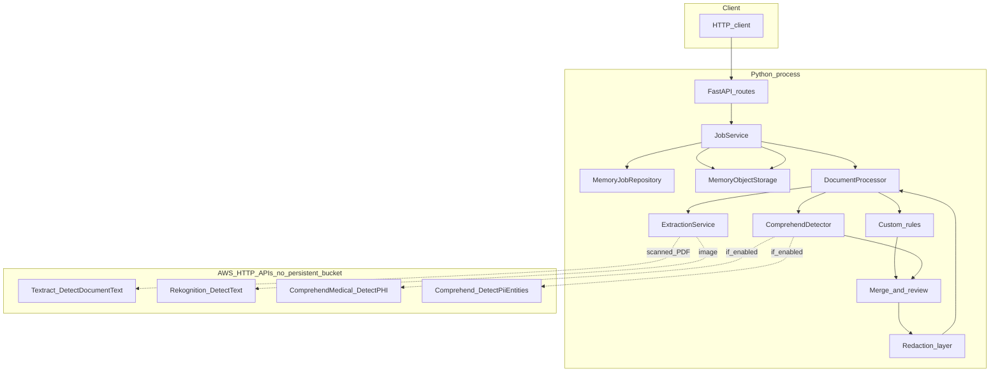
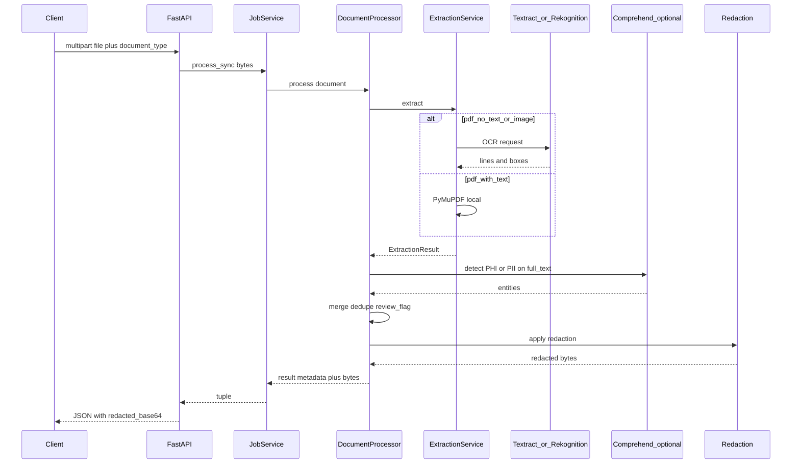
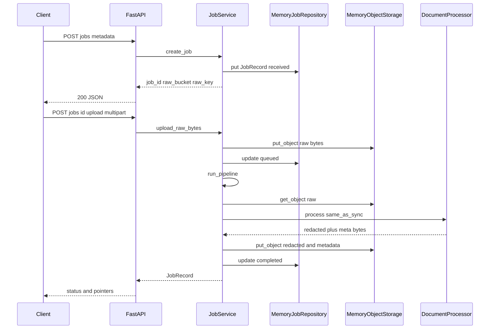

# Medical redaction server

FastAPI MVP: **synchronous** processing, **in-memory** job state and **in-memory** object bytes (no Amazon S3, no DynamoDB, no SQS). Optional **AWS managed APIs** (Textract, Rekognition, Comprehend) for OCR and PHI/PII detection.

## Run locally

```bash
cd server
python -m venv .venv && source .venv/bin/activate   # Windows: .venv\Scripts\activate
pip install -e ".[dev]"
uvicorn app.main:app --reload
```

Run **from the `server/` directory** so `.env` is loaded.

- Health: `GET /health`
- API: `GET/POST /api/v1/jobs/...`
- Swagger: `http://127.0.0.1:8000/docs`

---

## Architecture (logical)



### Architecture — what each part does (step by step)

1. **HTTP client** — Browser, `curl`, or another service calling the REST API.
2. **FastAPI routes** — Validates requests, maps `document_type`, streams multipart uploads, returns JSON (including base64 for sync redaction).
3. **JobService** — Orchestrates the multi-step job (`create` → `upload` → `run pipeline`) or delegates a one-shot **sync** call to `DocumentProcessor` without touching object storage for sync.
4. **MemoryJobRepository** — Holds `JobRecord` dicts in RAM; **lost on process restart**; not replicated.
5. **MemoryObjectStorage** — Key-value store `(partition, key) → bytes` inside the process; used for raw/redacted/metadata blobs in the **job** flow only.
6. **DocumentProcessor** — Single pipeline: extraction → detection → merge/review flag → redaction → metadata JSON bytes.
7. **ExtractionService** — Chooses **PyMuPDF** (PDF text layer), **Textract** (empty text layer), or **Rekognition** (images); returns `full_text` + optional line boxes.
8. **Custom rules** — Regex-based detectors (e.g. email, phone) on `full_text`.
9. **ComprehendDetector** — Calls Comprehend Medical + Comprehend when `USE_AWS_COMPREHEND=true`; otherwise returns no managed entities.
10. **Merge and review** — Deduplicates/overlaps entities; sets `review_required` if any confidence is below threshold.
11. **Redaction layer** — Text span replacement, PDF boxes (layout or search), or image rectangles from OCR lines.
12. **AWS HTTP APIs** — Stateless **request/response** calls; your app does **not** write results to **S3** in this codebase. Data is processed by AWS per service policies (not stored in *your* buckets by this app).

---

## Sequence — synchronous redaction (`POST /api/v1/jobs/process/sync`)



### Sequence (sync) — steps explained

1. **Client uploads** the file and `document_type` (`text`, `pdf`, or `image`) as multipart form data.
2. **FastAPI** reads the body and enforces `SYNC_MAX_BYTES` / timeout (`SYNC_MAX_SECONDS`).
3. **JobService.process_sync** forwards bytes to the processor **without** storing them in `MemoryObjectStorage`.
4. **DocumentProcessor** runs the full pipeline once.
5. **Extraction** runs locally (PyMuPDF) or calls **AWS OCR** (Textract for scanned PDF, Rekognition for image) when needed.
6. **Comprehend** (optional) receives the **extracted string** and returns entity spans.
7. **Merge / review** combines rule-based and managed hits and decides `completed` vs `review_required`.
8. **Redaction** produces the final file bytes in memory.
9. **Response** returns JSON: structured `result` plus **base64-encoded** redacted file; nothing is written to cloud object storage by this path.

---

## Sequence — job flow (`POST /jobs` → `POST /jobs/{id}/upload`)



### Sequence (job flow) — steps explained

1. **Create job** — Client sends filename, content type, and `document_type`; server allocates `job_id` and logical keys under partition `memory`.
2. **MemoryJobRepository** stores a `JobRecord` in state `received`.
3. **Response** returns `raw_bucket` / `raw_key` so the client knows where the upload will be stored **logically** (still in-process RAM).
4. **Upload** — Client sends the file via **multipart** to `POST .../upload` (no presigned S3 URL in this MVP).
5. **MemoryObjectStorage** stores raw bytes at `(memory, raw/{job_id}/...)`.
6. **Pipeline** runs **synchronously** in the same request: load raw from memory, same extraction/detection/redaction as sync.
7. **Outputs** — Redacted file and entity JSON are written back into **MemoryObjectStorage**; `JobRecord` is updated with `redacted_*` / `metadata_*` keys and final status.
8. **Client** can **GET `/jobs/{id}`** to read metadata and pointers; fetching binary outputs would require a **future download endpoint** (not implemented here) or using **sync** to receive bytes directly.

---

## Processing pipeline (inside `DocumentProcessor`)

1. **Document type** selects extraction and redaction implementations.
2. **Extraction** — Text: UTF-8 decode. PDF: PyMuPDF; if empty, Textract. Image: Rekognition.
3. **Detection** — Custom regex + optional Comprehend Medical / DetectPii.
4. **Merge** — Overlap handling and deduplication.
5. **Review flag** — Low confidence → `review_required`.
6. **Redaction** — Token replacement or black boxes using text/layout.
7. **Metadata JSON** — Serialised `ProcessingResultMetadata`.

---

## Environment files

| File | Purpose |
|------|---------|
| `.env.example` | Template (committed). |
| `.env` | Local values (**gitignored**). |

Variables: `AWS_REGION`, `SYNC_MAX_BYTES`, `SYNC_MAX_SECONDS`, `REDACTION_TOKEN`, `CONFIDENCE_REVIEW_THRESHOLD`, `USE_AWS_COMPREHEND`.

---

## AWS IAM (no S3 in this app)

| Service | When used | Typical action |
|---------|-----------|----------------|
| **Textract** | Scanned PDF (no text layer) | `textract:DetectDocumentText` |
| **Rekognition** | `document_type=image` | `rekognition:DetectText` |
| **Comprehend Medical** | `USE_AWS_COMPREHEND=true` | `comprehendmedical:DetectPHI` |
| **Comprehend** | `USE_AWS_COMPREHEND=true` | `comprehend:DetectPiiEntities` |

Credentials: `aws configure`, SSO, or env vars (`AWS_ACCESS_KEY_ID`, `AWS_SECRET_ACCESS_KEY`, `AWS_SESSION_TOKEN`).

---

## Testing with sample assets (repo root)

With server running and AWS configured as needed:

**PDF**

```bash
curl -s -X POST "http://127.0.0.1:8000/api/v1/jobs/process/sync" \
  -F "file=@assets/medical-report-sample-nigeria.pdf" \
  -F "document_type=pdf" -o /tmp/sync-pdf.json
python3 -c "import json,base64,pathlib; d=json.loads(pathlib.Path('/tmp/sync-pdf.json').read_text()); pathlib.Path('/tmp/redacted.pdf').write_bytes(base64.standard_b64decode(d['redacted_base64']))"
```

**PNG**

```bash
curl -s -X POST "http://127.0.0.1:8000/api/v1/jobs/process/sync" \
  -F "file=@assets/medical-report-sample-nigeria.png" \
  -F "document_type=image" -o /tmp/sync-png.json
```

**CLI (from `server/`)**

```bash
cd server
.venv/bin/python -c "
from pathlib import Path
from app.config import Settings
from app.models.job import DocumentType
from app.services.pipeline.processor import DocumentProcessor
root = Path.cwd().parent
for name, dt in [('medical-report-sample-nigeria.pdf', DocumentType.pdf), ('medical-report-sample-nigeria.png', DocumentType.image)]:
    raw = (root / 'assets' / name).read_bytes()
    r, red, _ = DocumentProcessor(Settings()).process(dt, raw, job_id='cli')
    (Path('/tmp') / f'redacted-{name}').write_bytes(red)
    print(name, len(r.entities), r.status.value)
"
```

---

## Resumo (PT)

- **Sem S3**: ficheiros e jobs ficam só na **memória** do processo Python.
- **AWS**: apenas APIs **Textract / Rekognition / Comprehend** quando aplicável; nenhum bucket teu é usado por este código.
- **Dois modos**: `process/sync` devolve o redigido no JSON; fluxo com `POST /jobs` + `upload` guarda bytes no armazenamento em memória e atualiza o `JobRecord`.
