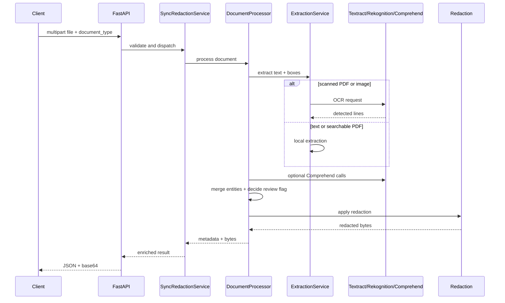

# Medical redaction server

FastAPI service for **local, synchronous** redaction of text, PDF, and image files.

The code is intentionally centered on a single request flow:

1. receive the file
2. extract text
3. detect sensitive spans
4. merge overlaps
5. apply redaction
6. return JSON with metadata plus the redacted file in base64

There is **no job queue**, **no in-memory job store**, and **no S3** in the current version.

## Run locally

```bash
cd server
python3 -m venv .venv
source .venv/bin/activate
pip install -e ".[dev]"
uvicorn app.main:app --reload
```

Run from `server/` so `.env` is loaded.

## Routes

- `GET /health`
- `POST /api/v1/process/sync`

Swagger is available at [http://127.0.0.1:8000/docs](http://127.0.0.1:8000/docs).

## Request flow



## Main modules

- `app/api/routes/process.py`
  Handles the HTTP endpoint, validates `document_type`, enforces size and timeout limits, and returns JSON.

- `app/services/sync_redaction.py`
  Wraps the single synchronous use case and adds request-level audit fields such as `submitter_id`.

- `app/services/pipeline/processor.py`
  Coordinates the whole pipeline: extraction, detection, merge, review decision, and redaction.

- `app/services/extraction/service.py`
  Chooses how text is extracted:
  - text: UTF-8 decode
  - PDF with text layer: PyMuPDF
  - scanned PDF: Textract
  - image: Rekognition

- `app/services/detection/custom_rules.py`
  Local regex rules for `SIN`, `EMAIL`, and `PHONE`.

- `app/services/detection/comprehend.py`
  Optional AWS PHI/PII detection when `USE_AWS_COMPREHEND=true`.

- `app/services/redaction/`
  Format-specific redaction:
  - text: token replacement
  - PDF: black boxes
  - image: black boxes

## Environment

`server/.env.example` contains the supported variables:

- `AWS_REGION`
- `SYNC_MAX_BYTES`
- `SYNC_MAX_SECONDS`
- `REDACTION_TOKEN`
- `CONFIDENCE_REVIEW_THRESHOLD`
- `USE_AWS_COMPREHEND`

If `USE_AWS_COMPREHEND=false`, only the local regex rules run.

## AWS services used

- Textract: OCR for scanned PDFs
- Rekognition: OCR for images
- Comprehend Medical: PHI detection
- Comprehend: PII detection

No S3 bucket is used by this app.

## Test with sample assets

With the server running:

```bash
curl -s -X POST "http://127.0.0.1:8000/api/v1/process/sync" \
  -F "file=@assets/medical-report-sample-nigeria.pdf" \
  -F "document_type=pdf" \
  -o /tmp/sync-pdf.json
```

Write the returned PDF locally:

```bash
python3 -c "import base64,json,pathlib; d=json.loads(pathlib.Path('/tmp/sync-pdf.json').read_text()); pathlib.Path('/tmp/redacted.pdf').write_bytes(base64.standard_b64decode(d['redacted_base64']))"
```

Image example:

```bash
curl -s -X POST "http://127.0.0.1:8000/api/v1/process/sync" \
  -F "file=@assets/medical-report-sample-nigeria_image.png" \
  -F "document_type=image" \
  -o /tmp/sync-image.json
```

## CLI usage

From `server/`:

```bash
.venv/bin/python -c "
from pathlib import Path
from app.config import Settings
from app.models.processing import DocumentType
from app.services.pipeline.processor import DocumentProcessor

root = Path.cwd().parent
processor = DocumentProcessor(Settings())

for name, doc_type in [
    ('medical-report-sample-nigeria.pdf', DocumentType.pdf),
    ('medical-report-sample-nigeria_image.png', DocumentType.image),
]:
    raw = (root / 'assets' / name).read_bytes()
    result, redacted, _ = processor.process(doc_type, raw, request_id='cli')
    (Path('/tmp') / f'redacted-{name}').write_bytes(redacted)
    print(name, len(result.entities), result.status.value)
"
```
